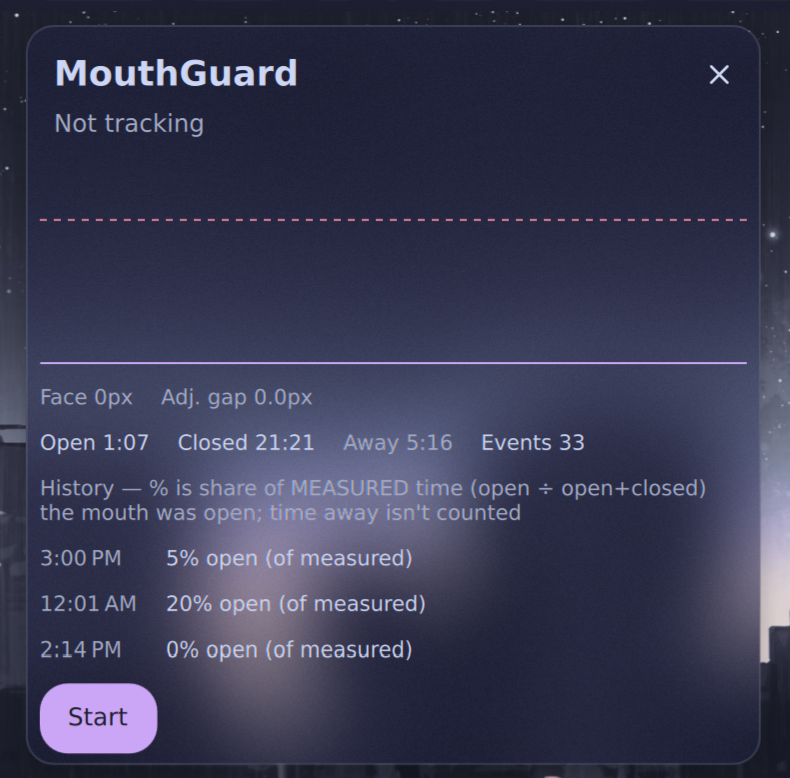
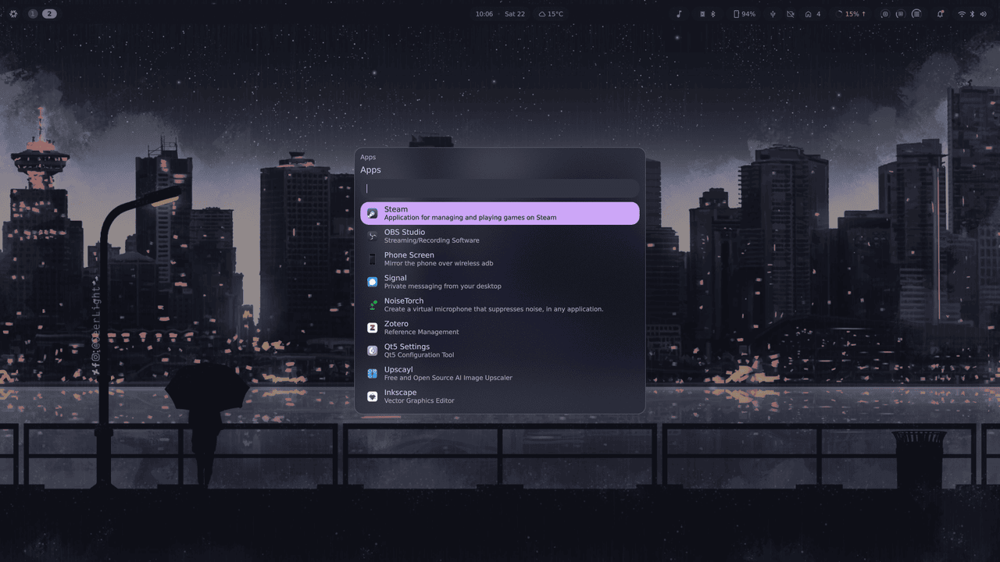

<div align="center">

# dms-plugins

**Plugins for [DankMaterialShell](https://github.com/AvengeMedia/DankMaterialShell).**

Written for [sitolamix](https://github.com/sitolam/sitolamix), but tied to nothing —
both are in the official plugin registry, so `dms plugins install` is all it takes
on any distro, and NixOS gets them as flake packages.

[](https://github.com/AvengeMedia/DankMaterialShell)
[](#license)
[](#)
[](https://github.com/AvengeMedia/dms-plugin-registry)

</div>

---

## The plugins

<table>
<tr>
<td width="50%" valign="top">

### [dankMenu](plugins/dankmenu)

One key to every command — a hierarchical, searchable root menu in the shape of
[Omarchy](https://github.com/basecamp/omarchy)'s `Super+Space`.

<a href="plugins/dankmenu"></a>

</td>
<td width="50%" valign="top">

### [mouthGuard](plugins/mouthguard)

Webcam mouth-closure tracker with alerts and session stats, running MediaPipe
Face Mesh locally on the NPU.

<a href="plugins/mouthguard"></a>

</td>
</tr>
</table>

| Plugin | Type | Needs | Docs |
| --- | --- | --- | --- |
| [`dankmenu`](plugins/dankmenu) | `daemon` | nothing beyond DMS | [README](plugins/dankmenu/README.md) |
| [`mouthguard`](plugins/mouthguard) | `composite` | a webcam, `python3` + `cv2` + `openvino` | [README](plugins/mouthguard/README.md) |

---

## Install

Both plugins are listed in the official
[DMS plugin registry](https://github.com/AvengeMedia/dms-plugin-registry), so the
short answer on **any distro** is:

```bash
dms plugins install dankMenu
dms plugins install mouthGuard
```

Then enable them in DMS under `Mod+,` → **Plugins**. `dms plugins list` shows
what's installed, and `dms plugins update` pulls newer versions later.

There is no build step for either plugin — they are QML and JavaScript, and
neither references a path above its own directory. MouthGuard is the one
exception to "nothing to build": it needs a Python detector with `cv2` and
`openvino`, which on most distros is a package install and on NixOS is a
`nix build`. See
[its README](plugins/mouthguard/README.md#install-the-python-dependencies).

<details>
<summary><b>From a clone instead</b> — for hacking on a plugin, or pinning it to this repo</summary>

DMS loads plugins from `~/.config/DankMaterialShell/plugins/<id>`, where `<id>`
must match the `id` in the plugin's `plugin.json` — `dankMenu` and `mouthGuard`,
camelCase, note the capital letters. Symlink the clone and a `git pull` updates
the plugin:

```bash
git clone https://github.com/sitolam/dms-plugins ~/src/dms-plugins
mkdir -p ~/.config/DankMaterialShell/plugins

ln -s ~/src/dms-plugins/plugins/dankmenu   ~/.config/DankMaterialShell/plugins/dankMenu
ln -s ~/src/dms-plugins/plugins/mouthguard ~/.config/DankMaterialShell/plugins/mouthGuard
```

Or copy just the one directory, if you don't want the clone lying around:

```bash
git clone --depth 1 https://github.com/sitolam/dms-plugins /tmp/dms-plugins
cp -r /tmp/dms-plugins/plugins/dankmenu ~/.config/DankMaterialShell/plugins/dankMenu
```

</details>

### NixOS, via home-manager

`dms plugins install` writes into `~/.config`, which a declarative setup usually
doesn't want, so take the plugins as flake packages instead:

```nix
# flake.nix
inputs.dms-plugins.url = "github:sitolam/dms-plugins";
```

```nix
programs.dank-material-shell.plugins = {
  dankMenu = {
    enable = true;
    src = inputs.dms-plugins.packages.${pkgs.system}.dankmenu;
  };
  mouthGuard = {
    enable = true;
    src = inputs.dms-plugins.packages.${pkgs.system}.mouthguard;
  };
};
```

With `managePluginSettings = true`, `plugin_settings.json` becomes a read-only
store symlink, so plugins **must** be enabled declaratively as above — the DMS
settings GUI cannot write to it.

MouthGuard additionally needs its detector binary: the ambient `python3` on NixOS
has neither `cv2` nor `openvino`, so link the flake's `mouthguard-detector` in as
the `result` the plugin looks for. See
[MouthGuard's README](plugins/mouthguard/README.md#install-the-python-dependencies).

---

## Using dankMenu

Full documentation lives in [its own README](plugins/dankmenu/README.md); this is
the short version — enough to have it working in about two minutes.

### 1. Bind a key

dankMenu has no default keybind: it exposes IPC verbs, and your compositor decides
what opens it. `toggle` opens the root menu, or closes it if already open.

**niri** — `~/.config/niri/config.kdl`:

```kdl
binds {
    Mod+Space { spawn "dms" "ipc" "call" "dankMenu" "toggle" "root"; }
}
```

**Hyprland** — `~/.config/hypr/hyprland.conf`:

```conf
bind = SUPER, SPACE, exec, dms ipc call dankMenu toggle root
```

**Sway** — `~/.config/sway/config`:

```
bindsym $mod+space exec dms ipc call dankMenu toggle root
```

**river**, **Wayfire**, anything else: bind the same shell command. It is a plain
one-shot process, so any launcher, keybind daemon or script can trigger it.

### 2. Drive it

```bash
dms ipc call dankMenu toggle           # open at the root, or close if open
dms ipc call dankMenu open system      # open straight into a submenu
dms ipc call dankMenu open power-menu  # aliases work too
dms ipc call dankMenu close
dms ipc call dankMenu refresh          # re-read the menu file
```

Because `open` takes a route, **any submenu can have its own keybind** — a power
menu on `Mod+Escape` is just `dms ipc call dankMenu open system`.

### 3. Navigate

Typing searches the whole subtree below wherever you are, with a breadcrumb
showing where each result lives:

 

| key | effect |
| --- | --- |
| `Enter` | enter a submenu, or run a row and close |
| `Right` | enter a submenu, when the cursor is at the end of the query |
| `Escape` | up one level; at the root, close |
| `Left` / `Backspace` | up one level, when the query is empty |
| `Up` / `Down` | move the selection |
| any text | search this level's whole subtree |

Every vim binding is `Ctrl`-prefixed — the search field is always focused, so bare
`hjkl` has to reach it as text: `Ctrl+J`/`Ctrl+K` move, `Ctrl+L`/`Ctrl+H` go in and
out, `Ctrl+D`/`Ctrl+U` jump half a page, `Ctrl+G` closes outright.

### 4. Make it yours

The whole menu is **one JSONC file**. The plugin ships
[`menu.jsonc`](plugins/dankmenu/menu.jsonc) as a starting point; point the
`menuPath` setting at your own file to replace it entirely. Whichever file is
live is watched, so saving it updates the menu immediately — no shell restart.

Object keys are dotted ids, and the dots *are* the hierarchy:

```jsonc
{
  // A submenu: no action, no target, no provider.
  "system": {"icon":"power_settings_new","label":"System","aliases":["power-menu"]},

  // An action: runs a shell command through `bash -lc`, then closes.
  "system.lock": {"icon":"lock","label":"Lock","action":"loginctl lock-session"},

  // A link: opens in your browser.
  "learn.niri": {"icon":"grid_view","label":"Niri","target":"https://github.com/YaLTeR/niri/wiki"},

  // A provider: contents generated at open time. "apps" is the only one so far.
  "apps": {"icon":"apps","label":"Apps","provider":"apps"},
}
```

Rows can also reflect the machine rather than just describe it — `when`, `checked`
and `disabled` are shell snippets judged by exit status:

<div align="center"></div>

```jsonc
"trigger.toggle.night": {
  "icon":"nightlight","label":"Night Mode",
  "checked":"dms ipc call night status | grep -q enabled",
  "action":"dms ipc call night toggle"
}
```

A fourth snippet, `labelCmd`, is judged by its *output* rather than its exit
status — the first line of stdout becomes the row's label, so a row can show a
live value instead of a fixed string.

Because `menuPath` is just a path, the file can be generated — see
[dankMenu's README](plugins/dankmenu/README.md#generating-the-tree) for the full
field reference, the condition semantics, and a worked Nix example.

---

## Using MouthGuard

Once enabled it adds a bar pill whose icon and color track the detection state,
and a Control Center tile. Left click opens the popout (live lip-gap chart,
session counters, last 5 sessions), middle click starts or stops a session, right
click mutes alerts without stopping tracking.

Everything else — the detector build, the two MediaPipe model files, NPU setup,
every setting, and the detection semantics — is in
[MouthGuard's README](plugins/mouthguard/README.md).

---

## Development

```bash
nix develop
pytest plugins/mouthguard                                     # MouthGuard's Python suite
qmltestrunner -input plugins/dankmenu/tests/tst_menumodel.qml # one file per run
nix flake check                                               # everything, headless
```

`qmltestrunner` takes one `-input` file per run, and its exit code is the
failure count rather than a flat 1.

MouthGuard keeps its own `flake.nix` under `plugins/mouthguard/`: its README and
`StartupCheck.qml` both document `nix build .#detector` *inside* the plugin
directory as the supported path for non-flake installs, and that has to keep
working. The root flake is what NixOS consumers pin. Both build the same
detector, from `plugins/mouthguard/package.nix` — a plain function of a nixpkgs
instance rather than a flake output, so neither flake defines it twice. That
matters more than it looks: the detector carries two hash-pinned MediaPipe model
files and an NPU runtime built around Intel's graph compiler, which nixpkgs does
not package and OpenVINO will only load from beside its own libraries.

---

## Publishing a plugin to the DMS registry

Both plugins here are listed in the
[DMS plugin registry](https://github.com/AvengeMedia/dms-plugin-registry) — that
is what makes them installable with `dms plugins install` and findable in the
in-shell plugin browser, rather than only by cloning this repo. Notes for adding
another; the [official guide](https://danklinux.com/docs/contributing-registry)
is the authority:

1. Fork [`AvengeMedia/dms-plugin-registry`](https://github.com/AvengeMedia/dms-plugin-registry).
2. Add `plugins/{github-username}-{plugin-name}.json`, lowercase and hyphenated
   — e.g. `sitolam-dankmenu.json`.
3. Fill in the entry:

   ```json
   {
     "id": "dankMenu",
     "name": "Dank Menu",
     "capabilities": ["daemon", "ipc"],
     "category": "utilities",
     "repo": "https://github.com/sitolam/dms-plugins",
     "path": "plugins/dankmenu",
     "author": "sitolam",
     "description": "Omarchy-style root menu: one key to every command, with built-in search",
     "dependencies": [],
     "compositors": ["any"],
     "distro": ["any"],
     "screenshot": "https://raw.githubusercontent.com/sitolam/dms-plugins/main/plugins/dankmenu/screenshots/root.png"
   }
   ```

   **`path` is what makes a monorepo work** — it points the registry at the
   subdirectory rather than the repo root, so one repo can list several plugins.

4. `id` and `name` **must match the plugin's own `plugin.json` exactly**, or the
   entry is rejected.
5. Run the repo's validation scripts, then open a PR. The registry opens a
   tracking issue for feedback, and listings are ranked by community upvotes.

Keep the description short, point `screenshot` at a real image, and make sure
the `compositors` and `distro` values are ones you have actually tested.

---

## Credits

dankMenu's design is [Omarchy](https://github.com/basecamp/omarchy)'s, by
[Basecamp](https://basecamp.com) and its contributors (MIT) — it shares no code,
but deliberately keeps their menu file schema field-for-field. MouthGuard is a
native port of [sitolam/mouthguard](https://github.com/sitolam/mouthguard).

## License

MIT.
