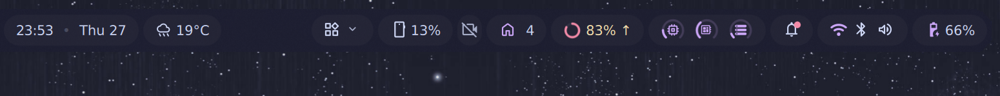

# barDropdown

One bar button that drops a panel of **real bar widgets** below the bar.

Click the button, and the widgets you listed appear in a small panel hanging
under it — each one live, with its own working popout. Click again to close.
Nothing on the bar moves, and nothing on the bar is covered.

Collapsed: one button where the ambient-sound, system-tray and USB widgets used
to sit.

## Why not just collapse them in place?

Because on this bar there is nowhere to expand to.

`DankBarContent.qml` anchors the three bar sections independently — left to
`parent.left`, right to `parent.right`, centre to `parent.horizontalCenter`.
They do not share a layout. So a right-section widget that grows wider pushes
only its own section's left edge further left, into the empty middle of the bar.
The centre widgets stay pinned to the screen centre and never move, and since
the centre section paints after the right one, an expansion wide enough to reach
them ends up *underneath* the clock.

That is a property of the bar, not a missing setting, and it is why both
existing collapsers — [dms-hidden-bar][hb] and [widget-group][wg] — behave the
same way in a side section: they reveal into dead space, then collide.

This plugin sidesteps it by not expanding along the bar at all. The members go
in a popout, which DMS anchors under the trigger and paints above the windows.

[hb]: https://github.com/hthienloc/dms-hidden-bar
[wg]: https://github.com/rdannenbring/widget-group

## Settings

| Setting | Meaning |
|---|---|
| Panel widgets | Member ids, left to right |
| Button icon | Material Symbols name (default `widgets`) |
| Button contents | Icon only, or icon and label |
| Button label | Text beside the icon, when contents is icon-and-label |
| Show chevron | Small arrow marking the button as one that opens |

A member id is whatever the bar calls the widget: a built-in like `systemTray`,
`clock` or `music`, or a plugin's own id such as `ambientSound`. A plugin
variant is `pluginId:variantId`. Third-party members must be **enabled** plugins
of type `widget`; built-ins need no setup.

The `targets` setting accepts either `["systemTray", …]` or
`[{ "id": "systemTray" }, …]`. The settings UI writes the second shape because
DMS's list editor can only store records; a config file writing the setting
directly will find the first shape more natural. Both work.

**A member must not also sit on the bar** — it would be rendered twice. Remove
it from the bar's widget list when you add it here, and run `dms restart`.

## Known caveats

- **A member's own popout opens over this panel.** Both are anchored just below
  the bar, so opening e.g. the tray menu covers the panel it was launched from.
  The panel is still there underneath and returns when the popout closes.
- **Vertical bars are not handled well.** Member popouts get their `y` from the
  anchor item on a left/right bar (`SettingsData.getPopupTriggerPosition`), and
  our anchor is inside the panel rather than on the bar, so a member's popout
  will be offset. On a top or bottom bar the same function derives `y` from the
  bar thickness and takes only `x` from the anchor, so members land correctly.

## Credit

`DropdownMember.qml` is `GroupMember.qml` from
[rdannenbring/widget-group][wg] (MIT — see `LICENSE.widget-group`), taken at
v0.7.0 and changed only in its header, type name and log tag. It is the fiddly
part of embedding a foreign bar widget: the property injection it performs
mirrors what DMS's own `WidgetHost.qml` does, and a single wrong binding there
yields a widget that loads but renders blank. Reimplementing it would have been
a worse copy of the same thing.
