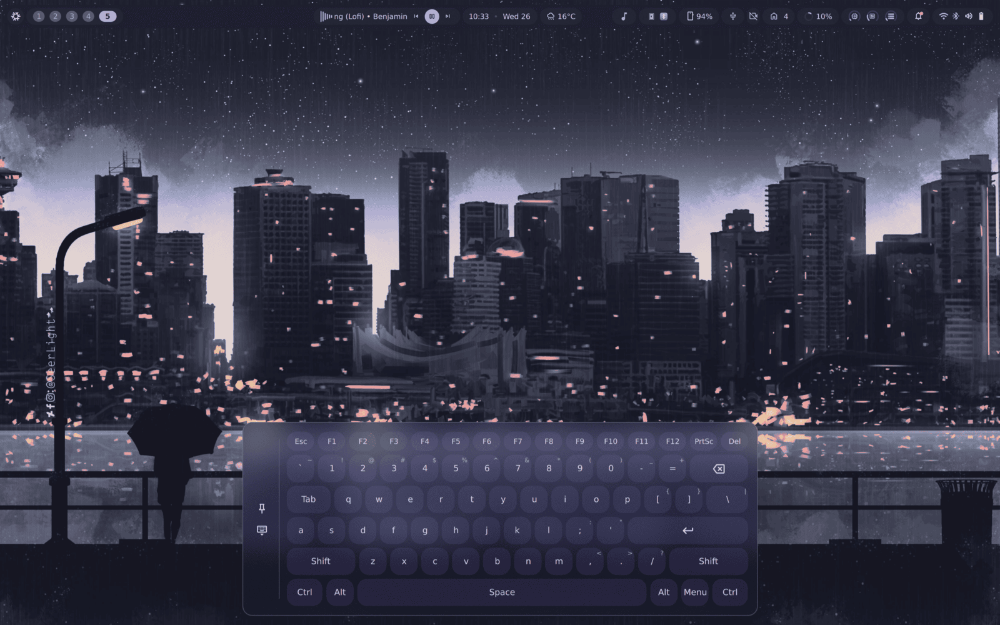
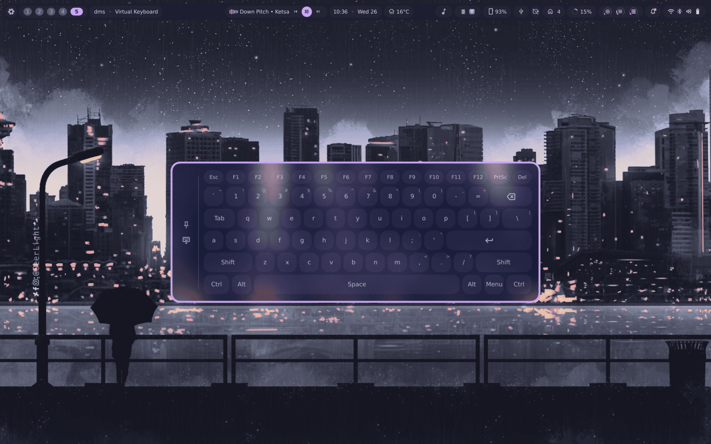

# virtualKeyboard

An on-screen keyboard for [DankMaterialShell](https://github.com/AvengeMedia/DankMaterialShell),
in the shape of the one in [end-4](https://github.com/end-4)'s
[dots-hyprland](https://github.com/end-4/dots-hyprland). It docks to the
bottom of the screen, types into whatever has focus through `ydotool`, and
pins out into a movable window when the docked position is in the way.



Pin it and the same keyboard becomes an ordinary floating window — draggable,
stackable, closable from its own titlebar:



## Credits

The design is [end-4](https://github.com/end-4)'s, from
[dots-hyprland](https://github.com/end-4/dots-hyprland) (GPL-3.0) — the
layout, the key shapes, the docked card and the pin-to-float idea are all
theirs, and this plugin's US QWERTY table is a port of their `layouts.js`
"English (US)" entry. Their dotfiles are worth a look regardless of whether
you run DMS.

## How it types

Keys are injected as raw Linux input events through
[ydotool](https://github.com/ReimuNotMoe/ydotool), not as Wayland text input.
That means it types into anything the focused window would accept from a
physical keyboard — terminals, games, password prompts, `Ctrl`/`Alt` combos
included — rather than only into applications that implement a text-input
protocol.

The consequence is that `ydotoold` has to be running and your user has to be
able to reach its socket. The plugin's startup check refuses to load without
`ydotool` on `PATH` and says so in the shell.

Modifiers latch rather than requiring two hands: tapping `Shift` arms it for
the next key, tapping it twice in quick succession caps-locks it, and `Ctrl`,
`Alt` and `Menu` stay held until pressed again or until the keyboard closes.
Number and symbol keys print their shifted character in the corner, the way a
physical keycap does.

## Install

Requires DMS ≥ 1.5.0 and `ydotool`. The plugin itself is QML and JavaScript —
no build step, and it references no path above its own root.

**Any distro**, from the [DMS plugin registry](https://github.com/AvengeMedia/dms-plugin-registry):

```bash
dms plugins install virtualKeyboard
```

Then enable it in DMS: `Mod+,` → Plugins → enable **Virtual Keyboard**.

### ydotool

Install `ydotool` from your distro (`ydotool` on Arch and Fedora,
`ydotool` + `ydotoold` on Debian/Ubuntu), then start its daemon:

```bash
systemctl --user enable --now ydotool     # or `ydotoold` — the unit name varies
```

Some distros ship `ydotoold` as a *system* service instead, with its socket at
a fixed path. When it is not the default `$XDG_RUNTIME_DIR/.ydotool_socket`,
point `YDOTOOL_SOCKET` at the real one **in the environment DMS itself runs
in** — the plugin spawns plain `ydotool`, which reads that variable:

```bash
systemctl --user set-environment YDOTOOL_SOCKET=/run/ydotoold.socket
```

Check it works before blaming the plugin:

```bash
ydotool key 30:1 30:0   # types `a` into the focused window
```

### NixOS, via home-manager

```nix
# flake.nix
inputs.dms-plugins.url = "github:sitolam/dms-plugins";
```

```nix
programs.dank-material-shell.plugins.virtualKeyboard = {
  enable = true;
  src = inputs.dms-plugins.packages.${pkgs.system}.virtualkeyboard;
};

programs.ydotool.enable = true;   # system-level: starts ydotoold

# ydotoold's socket is not the per-user default, so tell DMS where it is.
systemd.user.services.dms.Service.Environment = [
  "YDOTOOL_SOCKET=/run/ydotoold.socket"
];
```

## Using it

The plugin has no default keybind — it exposes IPC verbs, and your compositor
decides what opens it:

```bash
dms ipc call virtualKeyboard toggle
dms ipc call virtualKeyboard open
dms ipc call virtualKeyboard close
```

**niri** — `~/.config/niri/config.kdl`:

```kdl
binds {
    Mod+Shift+K { spawn "dms" "ipc" "call" "virtualKeyboard" "toggle"; }
}
```

**Hyprland** — `~/.config/hypr/hyprland.conf`:

```conf
bind = SUPER SHIFT, K, exec, dms ipc call virtualKeyboard toggle
```

There is also an optional DankBar pill (enable the plugin's widget in
`Mod+,` → DankBar): a keyboard icon that lights up while the keyboard is
open and toggles it on click. On a touchscreen that is the only way in, since
a keybind needs a keyboard to press.

The two buttons on the left edge of the card are **pin** and **hide**:

| button | effect |
| --- | --- |
| pin | swap between docked at the bottom and a floating window |
| hide | close the keyboard (`Escape` does the same while docked) |

While floating, dragging the empty padding around the buttons moves the
window — the compositor moves it natively, so tiling rules, snapping and
workspaces all behave as they do for any other window.

## Settings

`Mod+,` → Plugins → **Virtual Keyboard**:

| setting | default | effect |
| --- | --- | --- |
| Float by default | off | open as a floating window rather than docked |

## Notes

- The docked window sets `exclusiveZone: 0`, so it *overlays* the bottom of
  the screen rather than shrinking everything above it. Windows do not
  reflow when it opens, and a maximized window's last rows can end up behind
  it — pin it if that is in the way.
- Only US QWERTY ships today. The layout is plain data in
  [`layout-us.js`](layout-us.js): rows of `{keytype, label, labelShift, shape,
  keycode}`, with keycodes from `linux/input-event-codes.h`.
- Modifiers held by the keyboard are released when it closes, so a crash or a
  hasty `close` cannot leave `Ctrl` stuck down.

## Development

```bash
nix develop
qmltestrunner -input plugins/virtualkeyboard/tests/tst_keyshape.qml
qmltestrunner -input plugins/virtualkeyboard/tests/tst_layout_us.qml
nix flake check    # both suites, headless
```

`qmltestrunner` takes one `-input` file per run, and its exit code is the
failure count rather than a flat 1.

## License

MIT.
